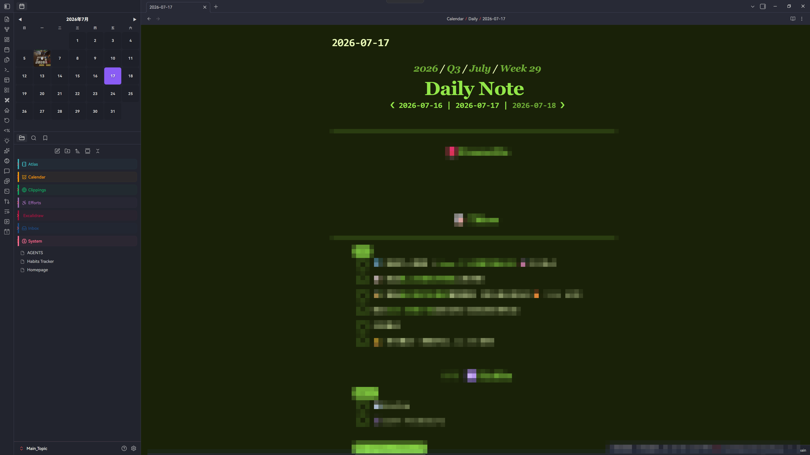

  <strong>English</strong> | <a href="README.zh-CN.md">中文</a>

---

# Dayline — Obsidian Plugin

Dayline is a visual journal for calendars, timelines, moods, memories, weather, and photos. It includes the monthly calendar, journal timeline, mood metadata, On This Day review, and media thumbnails.

## Features

- **Monthly calendar** in the left sidebar, above the file manager
- **Image thumbnails** — embedded images from daily notes as date cell backgrounds
- **Today highlight** — full accent color fill for today's date
- **Browsing-date highlight** — accent border for the date currently being viewed
- **One-click open** — click any date to open its daily note
- **Auto-create** — click a date with no note → confirmation dialog → create from Daily Notes template (Templater supported)
- **Configurable folder** — search-suggest for daily notes folder path
- **Thumbnail filter** — all embedded images or only date-prefixed filenames
- **Journal timeline** — compact search and date, mood, and favorite filters; external import folders are optional and shown as ordinary notes
- **Mood metadata** — five-level color picker with optional labels, stored in vault JSON by default

## Weather (Optional)

Enable weather data from [Open-Meteo](https://open-meteo.com/) (no API key needed) in settings:

| Setting | Description |
|---------|-------------|
| **Enable weather** | Toggle weather card in sidebar |
| **Latitude / Longitude** | Your coordinates for local weather |
| **Location name** | Display label (optional) |
| **Temperature units** | Celsius or Fahrenheit |
| **Auto-fetch** | Fetch when opening a daily note |
| **Cache TTL** | Hours before re-fetching |

Weather snapshots are stored in the plugin's `data.json`, keyed by date and weather configuration. Existing `_calendar_weather` frontmatter is read for backward compatibility and migrated when its coordinates and units match the current settings. A compact weather card appears below the month header showing icon, temperature, feels-like, humidity, and location. Cached dates show a small weather badge on the calendar grid. Open-Meteo requests use the location's automatic timezone. Use the **"Refresh Weather for Active Date"** command to force-update.

EXIF GPS reverse geocoding is disabled by default. Enable **Resolve GPS locations** only if you want coordinates sent to OpenStreetMap Nominatim to display place names.

## Journal timeline and imports

The timeline indexes the configured daily-notes folder by default (`Calendar/Daily`). Optional external-import folders can be added in Journal sources and are shown as ordinary journal notes without a separate entry type or source filter. Dates are resolved from the configured date field, `date`, `creationDate`, and then valid date-prefixed filenames; modification time is never used as a fallback.

Use [Day One Importer](https://github.com/MarcDonald/obsidian-day-one-importer) or [Obsidian Importer](https://github.com/obsidianmd/obsidian-importer) to create Markdown files, then add the output folder. This plugin does not parse JSON/ZIP exports or rewrite imported files. Mood metadata is authoritative in `Calendar/journal-metadata.json` by default; frontmatter mirroring is opt-in.

**Limitation**: Historical dates beyond the forecast window may return no data (archive API support is best-effort).

## Installation

- **BRAT**: Add `Haoo-7/Obsidian-Dayline` to BRAT
- **Manual**: Download `dayline.zip` from [Releases](https://github.com/Haoo-7/Obsidian-Dayline/releases), extract to `.obsidian/plugins/dayline/` in your vault, enable in Obsidian settings, then run command `Open Dayline`

## Files

| File | Description |
|------|-------------|
| `manifest.json` | Plugin metadata |
| `main.js` | Obsidian release artifact |
| `src/` | TypeScript core modules used by tests and the build facade |
| `tests/` | Unit tests for date, cache, excerpt, and safe DOM logic |
| `build.mjs` | esbuild release build |
| `libheif-bundle.js` | HEIC/HEIF decoder bundle |
| `Dayline 插件设计方案.md` | Original design doc (Chinese) |

## Settings

Configured in Obsidian Settings → Community Plugins → Dayline:

| Setting | Description |
|---------|-------------|
| **Daily notes folder** | Path to your daily notes folder (search + browse) |
| **Thumbnail filter** | `All embedded images` (default) or `Only date-prefixed` (filenames starting with `YYYY-MM-DD_`) |
| **Resolve GPS locations** | Opt-in reverse geocoding of EXIF GPS coordinates through OpenStreetMap Nominatim |
| **Journal sources** | Optional external-import folder configuration; the daily-notes folder is the default |
| **Mood metadata path** | Vault JSON path, default `Calendar/journal-metadata.json` |
| **Mirror mood to frontmatter** | Disabled by default |
| **Show mood markers on calendar** | Hide or show mood colors on calendar date cells |
| **Show weather on calendar** | Hide or show the weather card and date-cell weather icons |

## Templater Integration

If you have a template configured in Obsidian's Daily Notes plugin and Templater is installed, clicking a date without a note will create one using the template with all Templater variables resolved (`tp.file.title`, date, week number, etc.).

When upgrading from Calendar Sidebar 1.x, Dayline copies the old plugin `data.json` into `.obsidian/plugins/dayline/` only when the new data file does not already exist. Vault mood metadata and Markdown notes remain unchanged.

## Requirements

- Obsidian v1.5.0+
- Daily notes named `YYYY-MM-DD.md`
- Images embedded via `![[image.jpg]]`
